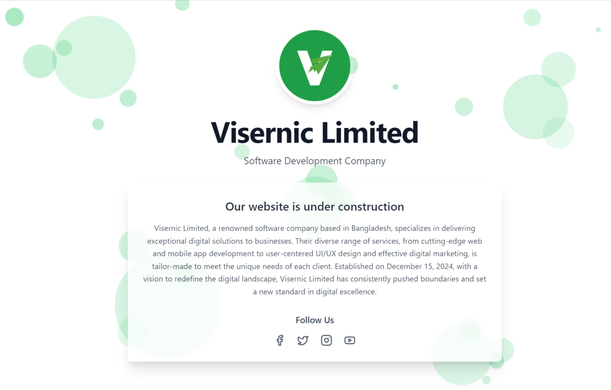

# Visernic - Personal Portfolio Website

[Live Site](https://www.visernic.net/)

Visernic is a modern, responsive personal portfolio website built to showcase skills, projects, and contact information. Designed with a sleek UI and smooth animations, it serves as a professional web presence.

## 🔥 Features
- Responsive Design
- Dark Mode Support
- Smooth Scroll & Transitions
- Sections for Projects, Skills, Contact

## 🛠️ Tech Stack
- HTML5
- CSS3 / TailwindCSS
- JavaScript
- GSAP (for animations)

## 📸 Preview

## 🧑‍💻 Author
Created by [Mostafa Niloy](https://visernic.com)
